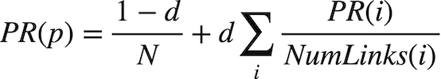

Travail pratique: PageRank
==========================

Dans ce travail pratique, vous devez implémenter une IA capable de classer 
des pages web en fonction de leur importance, selon l'algorithme PageRank.

**Note :** La dernière version de Python que vous devez utiliser dans ce 
cours est Python 3.12.

```shell
$ python pagerank.py corpus0
PageRank Results from Sampling (n = 10000)
  1.html: 0.2223
  2.html: 0.4303
  3.html: 0.2145
  4.html: 0.1329
PageRank Results from Iteration
  1.html: 0.2202
  2.html: 0.4289
  3.html: 0.2202
  4.html: 0.1307
```

Bien commencer
--------------

*   Télécharger les sources (avec `git clone ...`)

*   Dans le dossier,

    exécutez la commande suivant pour installer toutes les dépendances:

    ```shell
    uv sync --all-packages
    ```
    
*   Lancez le programme avec

    ```shell
    uv run pagerank
    ```

*   Exécutez les scripts de formattages et vérification avec

    ```shell
    uv run nox -t pagerank
    ```

Présentation
------------

Lorsque les moteurs de recherche comme Google affichent des résultats, 
ils le font en plaçant les pages les plus « importantes » et de meilleure 
qualité plus haut dans la liste. 

Mais comment le moteur de recherche sait-il quelles pages sont plus 
importantes que d'autres ?

Une heuristique pourrait être qu'une page « importante » est une page vers 
laquelle de nombreuses autres pages pointent (liens entrants).
Cependant, cette définition n'est pas parfaite : si quelqu'un veut faire 
paraître sa page plus importante, il lui suffirait de créer artificiellement 
de nombreuses autres pages qui pointent vers la sienne pour gonfler son 
classement.

C'est pour cette raison que l'algorithme **PageRank** a été créé par les 
co-fondateurs de Google. 
Dans l'algorithme PageRank, un site web est jugé plus important s'il reçoit 
des liens d'autres sites web importants, tandis que les liens provenant 
de sites moins importants ont un poids moindre. 
Il existe plusieurs stratégies pour calculer ces classements.


### Modèle du surfeur aléatoire

Une façon de conceptualiser le PageRank est d'utiliser le modèle du surfeur 
aléatoire, qui imagine le comportement d'un internaute hypothétique cliquant 
sur des liens au hasard.

Le modèle imagine un surfeur qui commence sur une page web au hasard, 
puis choisit aléatoirement des liens à suivre. S'il est sur la Page 2, 
par exemple, il choisira au hasard entre la Page 1 et la Page 3. 
Le PageRank d'une page peut donc être décrit comme la **probabilité qu'un 
surfeur aléatoire se trouve sur cette page à un instant donné**.

Une façon d'interpréter ce modèle est de le voir comme une **Chaîne de Markov**, 
où chaque page représente un état, et chaque page possède un modèle de 
transition qui choisit parmi ses liens au hasard. En échantillonnant 
(*sampling*) des états de manière aléatoire à partir de la chaîne de Markov, 
nous pouvons obtenir une estimation du PageRank de chaque page.

Cependant, pour éviter qu'un surfeur ne reste coincé dans un réseau de 
pages déconnectées du reste du web, nous introduisons un 
**facteur d'amortissement `d**` (*damping factor*). 
Avec une probabilité `d` (généralement fixée autour de `0.85`), 
le surfeur choisira un lien sur la page actuelle au hasard. 
Mais sinon (avec une probabilité de `1 - d`), le surfeur choisira une 
page au hasard parmi *toutes* les pages du corpus (y compris celle sur 
laquelle il se trouve).


### Algorithme itératif

Nous pouvons également définir le PageRank d'une page à l'aide d'une 
expression mathématique récursive. 
Soit `PR(p)` le PageRank d'une page donnée `p`. Il y a deux façons pour 
qu'un surfeur se retrouve sur cette page :

1.  Avec une probabilité de `1 - d`, le surfeur a choisi une page au hasard 
    et a atterri sur `p` (probabilité répartie équitablement entre toutes 
    les `N` pages du corpus).

2.  Avec une probabilité de `d`, le surfeur a suivi un lien depuis une page 
    `i` vers la page `p`.

En calculant de manière itérative ces valeurs pour chaque page en se basant 
sur les valeurs de l'itération précédente, les valeurs finiront par converger 
(c'est-à-dire qu'elles ne changeront pas de plus d'un petit seuil de tolérance 
à chaque itération).



Dans cette formule, *d* représente le facteur d'amortissement, *N* le 
nombre total de pages du corpus, *i* parcourt toutes les pages pointant 
vers la page *p*, et *NumLinks(i)* correspond au nombre de liens présents 
sur la page *i*.

Comment procéder alors pour calculer les valeurs PageRank de chaque page ? 
Nous pouvons le faire par itération : 
on commence par supposer que le PageRank de chaque page est égal à 1 / N 
(c'est-à-dire qu'il y a une probabilité égale de se trouver sur n'importe 
quelle page). 
Ensuite, on utilise la formule ci-dessus pour calculer de nouvelles valeurs 
PageRank pour chaque page, en se basant sur les valeurs précédentes. 
En répétant ce processus — c'est-à-dire en calculant un nouvel ensemble 
de valeurs PageRank pour chaque page à partir de l'ensemble précédent —, 
les valeurs PageRank finiront par converger (elles ne varieront plus que 
d'un faible seuil à chaque itération).

Dans le cadre de ce projet, vous mettrez en œuvre ces deux approches pour 
calculer le PageRank : d'une part, par échantillonnage de pages via la 
simulation d'un « surfeur aléatoire » (chaîne de Markov) et, d'autre part, 
par l'application itérative de la formule du PageRank.


### Compréhension du code fourni

Ouvrez `__inti__.py`. Remarquez d'abord la définition de deux constantes : 
`DAMPING` représente le facteur d'amortissement (`0.85`), et 
`SAMPLES` représente le nombre d'échantillons à utiliser (`10 000`).

La fonction `main` utilise la fonction `crawl` pour analyser un répertoire 
de fichiers HTML et retourner un dictionnaire représentant le corpus. 
Les clés sont les noms des pages (ex. `"2.html"`), et les valeurs sont des 
ensembles (`sets`) de toutes les pages liées par cette clé.


Spécifications
--------------

La cohérence du formattage du code, la clareté du code, le choix de structures
de données et d'algorithmes optimaux et les principes des bonnes pratiques
de programmation (S.O.L.I.D., par exemple) sont évalués.

Le code qui échoue les vérifiations automatiques sera systématiquement
pénalisés. Pour exécuter les vérifications automatiques, lancez la commande

```shell
uv run nox -t pagerank
```

Vous ne devez rien modifier d'autre dans `__init__.py` que les trois fonctions 
demandées, bien que vous puissiez écrire des fonctions auxiliaires. 
Vous pouvez importer `numpy` ou `pandas`, mais aucun autre module tiers 
n'est autorisé.

Complétez l'implémentation de `transition_model`, `sample_pagerank` et 
`iterate_pagerank`.

### `transition_model`

La fonction `transition_model` doit retourner un dictionnaire représentant 
la distribution de probabilité de la prochaine page qu'un surfeur aléatoire 
visiterait, compte tenu d'un corpus, d'une page actuelle et d'un facteur
d'amortissement.

*   La fonction accepte trois arguments : `corpus`, `page`, et `damping_factor`.

*   La valeur de retour doit être un dictionnaire Python avec une clé pour 
    *chaque* page du corpus. Chaque clé doit être associée à sa probabilité 
    d'être choisie ensuite. La somme des probabilités doit être égale à `1`.
    
*   Avec une probabilité équivalente au `damping_factor`, le surfeur doit 
    choisir aléatoirement l'un des liens sortants de la `page` 
    (avec une probabilité égale pour chacun).

*   Avec une probabilité de `1 - damping_factor`, le surfeur doit choisir 
    aléatoirement l'une des pages du corpus en entier 
    (avec une probabilité égale).

*   (*Random Surfer Model*) **Attention :** Si la `page` ne possède *aucun* 
    lien sortant, la fonction doit retourner une distribution de probabilité 
    qui choisit aléatoirement parmi toutes les pages du corpus de manière 
    égale (comme si la page possédait un lien vers toutes les pages, 
    y compris elle-même).


### `sample_pagerank`

La fonction `sample_pagerank` doit accepter un corpus, un facteur 
d'amortissement et un nombre d'échantillons, puis retourner une estimation 
du PageRank pour chaque page.

*   La fonction accepte trois arguments : `corpus`, `damping_factor`, et 
    `n` (le nombre d'échantillons).

*   La valeur de retour doit être un dictionnaire avec une clé pour chaque 
    page. Chaque clé pointe vers le PageRank estimé de cette page (la 
    proportion de tous les échantillons qui correspondent à cette page). 
    La somme des valeurs doit être égale à `1`.

*   Le tout premier échantillon doit être généré en choisissant une page 
    complètement au hasard.

*   Pour chacun des échantillons suivants, le prochain échantillon doit 
    être généré à partir du modèle de transition de l'échantillon précédent 
    (vous devriez passer l'échantillon précédent à votre fonction 
    `transition_model`).

*   Vous pouvez supposer que `n` sera d'au moins `1`.


### `iterate_pagerank`

La fonction `iterate_pagerank` doit accepter un corpus et un facteur 
d'amortissement, calculer les PageRanks selon la formule itérative, et 
retourner le PageRank de chaque page avec une précision à `0.001` près.

*   La fonction accepte deux arguments : `corpus` et `damping_factor`.

*   La valeur de retour doit être un dictionnaire similaire aux précédents. 
    La somme des valeurs doit être égale à `1`.
    
*   La fonction doit commencer par assigner à chaque page un rang initial 
    de `1 / N`, où `N` est le nombre total de pages dans le corpus.

*   La fonction doit ensuite calculer répétitivement de nouvelles valeurs 
    de rang basées sur les valeurs actuelles, selon la formule du PageRank.
    
*   Une page qui n'a *aucun* lien doit être interprétée comme ayant un 
    lien vers toutes les pages du corpus (y compris elle-même).

*   Ce processus doit se répéter **jusqu'à ce qu'aucune valeur de PageRank 
    ne change de plus de `0.001**` entre l'itération précédente et la nouvelle 
    itération.


Conseils
--------

*   Si vous souhaitez tester vos fonctions dans un autre fichier Python, 
    vous pouvez les importer avec : `from pagerank import crawl`.

    N'hésitez pas à utiliser le répertoire `test` pour ce faire ! 

*   Vous êtes libre d'ajouter des fonctions auxiliaires.

*   Vous pourriez trouver les fonctions du module 
    [`random`](https://docs.python.org/3/library/random.html) 
    de la librairie standard de Python très utiles pour prendre des 
    décisions pseudo-aléatoires.
